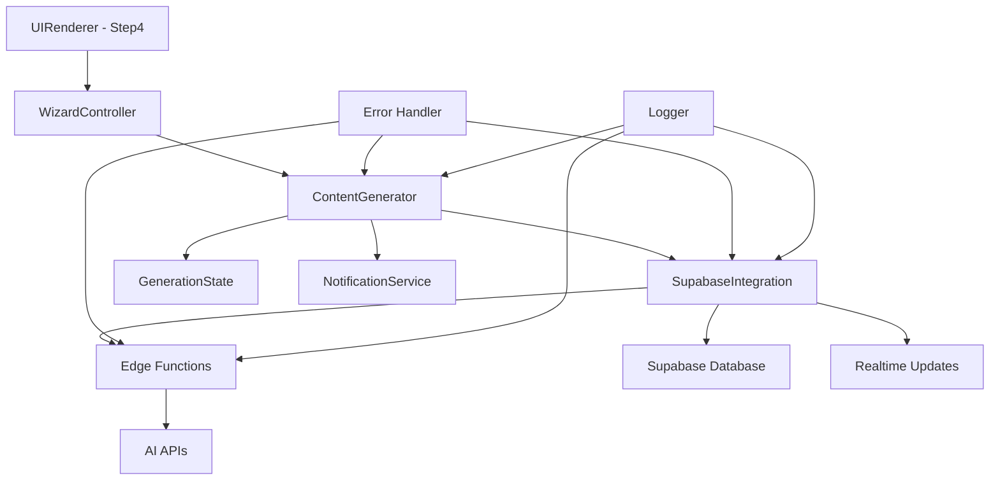

# 記事生成バグ修正 - 設計ドキュメント

## 概要

HubPilot Free SEO記事作成エージェントの記事生成機能において発生している複数のバグと設計上の問題を体系的に修正します。主な問題点は以下の通りです：

1. **記事生成フローの不安定性**: ボタンクリックから記事生成完了までのフローが不安定
2. **ContentGeneratorクラスの問題**: AI API連携とフォー具合
3. **SupabaseIntegration問題**: Edge Function呼び出しとエラーハンドリングの不備
4. **Edge Functions問題**: AI API連携とレスポンス処理の不具合
5. **進捗管理の問題**: リアルタイム進捗表示の不正確性
6. **エラーハンドリング不足**: 適切なエラーメッセージとフォールバック処理の欠如

本設計では、これらの問題を根本的に解決し、安定した記事生成機能を実現します。

## アーキテクチャ

### 修正対象コンポーネント



### 修正アプローチ

1. **段階的修正**: 各コンポーネントを順次修正し、統合テストで検証
2. **後方互換性**: 既存の動作を維持しながら問題を修正
3. **フォールバック強化**: AI API失敗時のモック生成機能を強化
4. **エラーハンドリング統一**: 全コンポーネントで統一されたエラー処理
5. **ログ機能強化**: デバッグとトラブルシューティングのためのログ強化

## コンポーネントとインターフェース

### 1. ContentGenerator修正

現在の問題点：
- `generateArticles`メソッドでの進捗コールバック処理の不備
- AI API失敗時のフォールバック処理の不安定性
- 記事データ形式の不統一

修正内容：
```javascript
class ContentGenerator {
    // 修正: 記事生成メソッドの安定化
    async generateArticles(pages, progressCallback) {
        this.isGenerating = true;
        this.generationState.start(pages.length);

        const articles = [];

        try {
            for (let i = 0; i < pages.length; i++) {
                const page = pages[i];

                // 進捗コールバック実行
                this.executeProgressCallback(progressCallback, i + 1, pages.length, page.title);

                // 記事生成（フォールバック付き）
                const article = await this.generateSingleArticleWithFallback(page);
                articles.push(article);

                // 生成状態更新
                this.generationState.updateProgress(i + 1, pages.length);
            }

            this.generationState.complete();
            return articles;

        } catch (error) {
            this.generationState.error(error.message);
            throw error;
        } finally {
            this.isGenerating = false;
        }
    }

    // 新規: 単一記事生成（フォールバック付き）
    async generateSingleArticleWithFallback(page) {
        try {
            // AI生成を試行
            if (this.supabaseIntegration && await this.supabaseIntegration.isConfigured()) {
                return await this.generateArticleWithAI(page);
            } else {
                return await this.generateArticleMock(page);
            }
        } catch (error) {
            console.warn(`AI生成失敗、モック生成にフォールバック: ${page.title}`, error);
            return await this.generateArticleMock(page);
        }
    }

    // 修正: 進捗コールバック実行
    executeProgressCallback(callback, current, total, currentPage) {
        if (typeof callback === 'function') {
            try {
                callback({
                    current,
                    total,
                    currentPage,
                    progress: (current / total) * 100
                });
            } catch (error) {
                console.error('進捗コールバックエラー:', error);
            }
        }
    }
}
```

### 2. SupabaseIntegration修正

現在の問題点：
- Edge Function呼び出し時のパラメータ形式の不統一
- エラーハンドリングの不備
- リトライ機能の欠如

修正内容：
```javascript
class SupabaseIntegration {
    // 修正: 記事生成メソッドの統一
    async generateArticle({ title, headings, targetWordCount }) {
        if (!this.isInitialized) {
            return this.mockGenerateArticle(title, headings, targetWordCount);
        }

        try {
            const response = await this.callEdgeFunctionWithRetry('generate-article', {
                title,
                headings: headings || [],
                targetWordCount: targetWordCount || 2000,
                settings: {
                    tone: 'です・ます調',
                    targetAudience: '一般ユーザー'
                }
            });

            return this.validateArticleResponse(response);

        } catch (error) {
            console.error('記事生成エラー:', error);
            return this.mockGenerateArticle(title, headings, targetWordCount);
        }
    }

    // 新規: Edge Function呼び出し（リトライ付き）
    async callEdgeFunctionWithRetry(functionName, params, maxRetries = 3) {
        let lastError;

        for (let attempt = 1; attempt <= maxRetries; attempt++) {
            try {
                const { data, error } = await this.supabase.functions.invoke(functionName, {
                    body: params
                });

                if (error) throw error;
                return data;

            } catch (error) {
                lastError = error;
                console.warn(`Edge Function呼び出し失敗 (試行 ${attempt}/${maxRetries}):`, error);

                if (attempt < maxRetries) {
                    await this.delay(1000 * attempt); // 指数バックオフ
                }
            }
        }

        throw lastError;
    }

    // 新規: レスポンス検証
    validateArticleResponse(response) {
        if (!response || typeof response !== 'object') {
            throw new Error('無効なレスポンス形式');
        }

        if (!response.content || typeof response.content !== 'string') {
            throw new Error('記事コンテンツが不正');
        }

        return {
            content: response.content,
            wordCount: response.wordCount || response.content.length
        };
    }
}
```

### 3. Edge Functions修正

現在の問題点：
- 入力パラメータの検証不足
- AI APIエラーハンドリングの不備
- レスポンス形式の不統一

修正内容：
```typescript
// generate-article/index.ts
serve(async (req) => {
    if (req.method === 'OPTIONS') {
        return new Response('ok', { headers: corsHeaders });
    }

    try {
        // 入力検証
        const requestData = await req.json();
        const validatedInput = validateArticleRequest(requestData);

        // AI API呼び出し
        const article = await generateArticleWithAI(validatedInput);

        // レスポンス形式統一
        return new Response(
            JSON.stringify({
                success: true,
                content: article.content,
                wordCount: article.wordCount,
                generationTime: article.generationTime
            }),
            { headers: { ...corsHeaders, 'Content-Type': 'application/json' } }
        );

    } catch (error) {
        console.error('記事生成エラー:', error);

        return new Response(
            JSON.stringify({
                success: false,
                error: error.message,
                errorCode: getErrorCode(error)
            }),
            {
                headers: { ...corsHeaders, 'Content-Type': 'application/json' },
                status: 400
            }
        );
    }
});

// 新規: 入力検証
function validateArticleRequest(data: any): ArticleRequest {
    if (!data.title || typeof data.title !== 'string') {
        throw new Error('記事タイトルが必要です');
    }

    if (!Array.isArray(data.headings)) {
        data.headings = [];
    }

    if (!data.targetWordCount || data.targetWordCount < 500) {
        data.targetWordCount = 2000;
    }

    return data as ArticleRequest;
}

// 新規: エラーコード取得
function getErrorCode(error: Error): string {
    if (error.message.includes('API key')) return 'API_KEY_ERROR';
    if (error.message.includes('network')) return 'NETWORK_ERROR';
    if (error.message.includes('timeout')) return 'TIMEOUT_ERROR';
    return 'UNKNOWN_ERROR';
}
```

### 4. 進捗管理機能修正

現在の問題点：
- 進捗表示の不正確性
- リアルタイム更新の遅延
- UI更新の不安定性

修正内容：
```javascript
class ProgressManager {
    constructor() {
        this.currentProgress = 0;
        this.totalItems = 0;
        this.currentItem = '';
        this.startTime = null;
    }

    // 進捗開始
    start(totalItems) {
        this.totalItems = totalItems;
        this.currentProgress = 0;
        this.currentItem = '';
        this.startTime = Date.now();
        this.updateUI();
    }

    // 進捗更新
    update(current, currentItem) {
        this.currentProgress = current;
        this.currentItem = currentItem;
        this.updateUI();
    }

    // UI更新
    updateUI() {
        const percentage = Math.round((this.currentProgress / this.totalItems) * 100);
        const remaining = this.totalItems - this.currentProgress;
        const elapsed = this.startTime ? Date.now() - this.startTime : 0;
        const estimatedTotal = elapsed > 0 ? (elapsed / this.currentProgress) * this.totalItems : 0;
        const estimatedRemaining = estimatedTotal - elapsed;

        // 進捗バー更新
        const progressFill = document.getElementById('progress-fill');
        const progressPercentage = document.getElementById('progress-percentage');
        const progressText = document.getElementById('progress-text');
        const completedCount = document.getElementById('completed-count');
        const remainingCount = document.getElementById('remaining-count');

        if (progressFill) progressFill.style.width = `${percentage}%`;
        if (progressPercentage) progressPercentage.textContent = `${percentage}%`;
        if (progressText) progressText.textContent = `記事 ${this.currentProgress}/${this.totalItems} を作成中...`;
        if (completedCount) completedCount.textContent = this.currentProgress.toString();
        if (remainingCount) remainingCount.textContent = remaining.toString();

        // 現在の記事表示
        const currentArticleEl = document.getElementById('current-article');
        if (currentArticleEl && this.currentItem) {
            currentArticleEl.textContent = this.currentItem;
        }

        // 推定時間表示
        if (estimatedRemaining > 0 && remaining > 0) {
            const estimatedMinutes = Math.ceil(estimatedRemaining / 60000);
            const estimatedTimeEl = document.getElementById('estimated-time');
            if (estimatedTimeEl) {
                estimatedTimeEl.textContent = `約${estimatedMinutes}分`;
            }
        }
    }

    // 完了
    complete() {
        this.currentProgress = this.totalItems;
        this.currentItem = '完了';
        this.updateUI();

        // 完了メッセージ
        const progressStatus = document.getElementById('progress-status');
        if (progressStatus) {
            progressStatus.textContent = '記事生成が完了しました！';
        }
    }
}
```

### 5. エラーハンドリング統一

現在の問題点：
- エラーメッセージの不統一
- エラー種別の判定不備
- ユーザーフレンドリーでないメッセージ

修正内容：
```javascript
class ErrorHandler {
    // エラーメッセージマップ
    static ERROR_MESSAGES = {
        'API_KEY_ERROR': 'API キーの設定を確認してください',
        'NETWORK_ERROR': 'ネットワーク接続を確認してください',
        'TIMEOUT_ERROR': 'タイムアウトが発生しました。しばらく時間をおいて再試行してください',
        'SUPABASE_ERROR': 'データベース接続エラーです。管理者にお問い合わせください',
        'AI_API_ERROR': 'AI APIに接続できません',
        'DATA_SAVE_ERROR': 'データの保存に失敗しました',
        'UNKNOWN_ERROR': '予期しないエラーが発生しました'
    };

    // エラー処理
    static handle(error, context, options = {}) {
        const errorCode = this.getErrorCode(error);
        const userMessage = this.ERROR_MESSAGES[errorCode] || this.ERROR_MESSAGES['UNKNOWN_ERROR'];

        // ログ記録
        console.error(`[${context}] ${errorCode}:`, error);

        // ユーザー通知
        if (options.notify !== false) {
            window.notificationService?.show(userMessage, 'error');
        }

        // フォールバック処理
        if (options.fallback) {
            return options.fallback();
        }

        return { success: false, error: userMessage, errorCode };
    }

    // エラーコード判定
    static getErrorCode(error) {
        const message = error.message || error.toString();

        if (message.includes('API key') || message.includes('Unauthorized')) {
            return 'API_KEY_ERROR';
        }
        if (message.includes('network') || message.includes('fetch')) {
            return 'NETWORK_ERROR';
        }
        if (message.includes('timeout')) {
            return 'TIMEOUT_ERROR';
        }
        if (message.includes('supabase') || message.includes('database')) {
            return 'SUPABASE_ERROR';
        }
        if (message.includes('AI API') || message.includes('OpenAI') || message.includes('DeepSeek')) {
            return 'AI_API_ERROR';
        }
        if (message.includes('save') || message.includes('storage')) {
            return 'DATA_SAVE_ERROR';
        }

        return 'UNKNOWN_ERROR';
    }
}
```

## データモデル

### 統一記事データ形式

```javascript
// 記事生成リクエスト形式
const ArticleGenerationRequest = {
    title: string,           // 記事タイトル
    headings: Array<{        // 見出し構造
        id: string,
        text: string,
        level: number
    }>,
    targetWordCount: number, // 目標文字数
    settings: {
        tone: string,        // 文体
        targetAudience: string, // 対象読者
        keywords: Array<string> // SEOキーワード
    }
};

// 記事生成レスポンス形式
const ArticleGenerationResponse = {
    success: boolean,
    content: string,         // 記事本文
    wordCount: number,       // 実際の文字数
    generationTime: number,  // 生成時間（秒）
    aiProvider: string,      // 使用したAI（'deepseek', 'openai', 'mock'）
    error?: string,          // エラーメッセージ
    errorCode?: string       // エラーコード
};

// 進捗更新データ形式
const ProgressUpdate = {
    current: number,         // 現在の進捗
    total: number,          // 総数
    currentItem: string,    // 現在処理中のアイテム
    progress: number,       // 進捗率（0-100）
    estimatedRemaining: number // 推定残り時間（ミリ秒）
};
```

## 正確性プロパティ

*A property is a characteristic or behavior that should hold true across all valid executions of a system-essentially, a formal statement about what the system should do. Properties serve as the bridge between human-readable specifications and machine-verifiable correctness guarantees.*

### Property 1: 進捗更新の単調性
*For all* 記事生成プロセスにおいて、進捗値は単調増加し、0から総記事数の範囲内で更新される
**Validates: Requirements 1.2, 5.2**

### Property 2: フォールバック機能の確実性
*For all* AI API呼び出し失敗時において、システムは必ずフォールバック処理を実行し、モック記事を生成する
**Validates: Requirements 1.3, 2.3**

### Property 3: データ永続化の一貫性
*For all* 生成された記事において、データストレージに保存される記事データは生成時のデータと一致する
**Validates: Requirements 1.4, 2.4**

### Property 4: エラーメッセージの適切性
*For all* エラー発生時において、システムは適切なエラーメッセージを表示し、エラーの種類に応じた対処法を提示する
**Validates: Requirements 1.5, 6.1, 6.2, 6.3, 6.4, 6.5**

### Property 5: パラメータ渡しの正確性
*For all* ContentGeneratorからSupabaseIntegrationへの呼び出しにおいて、正しい形式のパラメータが渡される
**Validates: Requirements 2.1, 3.1**

### Property 6: 進捗コールバックの実行
*For all* 記事生成プロセスにおいて、進捗更新時にコールバック関数が正しく実行される
**Validates: Requirements 2.2**

### Property 7: クリーンアップ処理の実行
*For all* 記事生成プロセスの中断時において、システムは適切にリソースを解放し、状態をクリーンアップする
**Validates: Requirements 2.5**

### Property 8: Edge Function呼び出しの正確性
*For all* SupabaseIntegrationからEdge Functionへの呼び出しにおいて、正しいパラメータ形式で送信される
**Validates: Requirements 3.1**

### Property 9: リトライ機能の動作
*For all* ネットワークエラー発生時において、システムは設定された回数だけリトライを実行する
**Validates: Requirements 3.4**

### Property 10: モックモード切り替えの自動性
*For all* Supabase未設定状態において、システムは自動的にモックモードに切り替わり、モック記事を生成する
**Validates: Requirements 3.5**

### Property 11: 入力パラメータ検証の実行
*For all* Edge Functionへのリクエストにおいて、入力パラメータが適切に検証される
**Validates: Requirements 4.1**

### Property 12: AI APIパラメータの適切性
*For all* AI API呼び出し時において、適切なプロンプトとパラメータが使用される
**Validates: Requirements 4.2**

### Property 13: レスポンス処理の正確性
*For all* AI APIからのレスポンスにおいて、内容が適切に処理され、統一された形式で返される
**Validates: Requirements 4.3**

### Property 14: 進捗記録の正確性
*For all* 複数記事生成時において、進捗状況がデータベースに正しく記録される
**Validates: Requirements 4.4**

### Property 15: ログ記録の実行
*For all* エラー発生時において、詳細なエラー情報がログに記録される
**Validates: Requirements 4.5, 10.1, 10.2, 10.3, 10.4, 10.5**

### Property 16: 進捗表示の正確性
*For all* 記事生成プロセスにおいて、現在生成中の記事タイトル、完了数、残り数が正確に表示される
**Validates: Requirements 5.3, 5.4**

### Property 17: データ形式の統一性
*For all* システム間のデータ交換において、統一されたデータ形式が使用される
**Validates: Requirements 7.1, 7.2, 7.3, 7.4, 7.5**

### Property 18: パフォーマンス制約の遵守
*For all* 記事生成プロセスにおいて、処理開始時間、タイムアウト設定、同時実行数制限、メモリ使用量が適切な範囲内である
**Validates: Requirements 8.1, 8.2, 8.3, 8.4, 8.5**

## エラーハンドリング

### エラー分類と対処法

1. **AI APIエラー**
   - 接続エラー → フォールバック処理
   - 認証エラー → 設定確認メッセージ
   - レート制限 → リトライ処理

2. **ネットワークエラー**
   - タイムアウト → リトライ処理
   - 接続失敗 → ネットワーク確認メッセージ

3. **データエラー**
   - 保存失敗 → 再試行とローカル保存
   - 形式エラー → データ検証と修正

4. **システムエラー**
   - メモリ不足 → リソース解放
   - 予期しないエラー → 汎用エラーメッセージ

## テスト戦略

### 二重テストアプローチ

**単体テスト**:
- 各修正メソッドの個別機能テスト
- エラーケースとエッジケースのテスト
- モック/スタブを使用した分離テスト

**プロパティベーステスト**:
- JSVerifyを使用した全入力の検証
- 最小反復回数: 100回/プロパティ
- ランダム入力による包括的テスト

**統合テスト**:
- 修正されたコンポーネント間の連携テスト
- エンドツーエンドの記事生成フローテスト
- エラーシナリオの統合テスト

### テスト設定

各プロパティテストは以下の形式でタグ付け:
```javascript
// Feature: article-generation-bug-fixes, Property 1: 進捗更新の単調性
```

最小反復回数: 100回（ランダム化による包括的検証のため）
