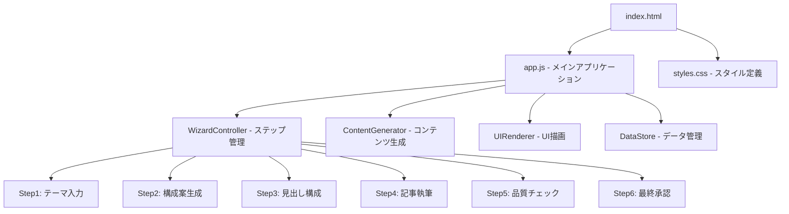

# 設計ドキュメント

## 概要

SEO記事作成エージェントアプリケーションは、HubSpotのトピッククラスターモデルを自動化するウィザード形式のWebアプリケーションです。ユーザーはテーマを入力し、6つのステップを通じてピラーページと10個のクラスターページを含む包括的なコンテンツ戦略を作成できます。

アプリケーションはHTML、CSS、JavaScriptのみを使用したシンプルな単一ページアプリケーション（SPA）として実装され、HubSpotのようなクリーンで信頼感のあるBtoB SaaS風デザインを採用します。

## アーキテクチャ

### 全体構成



### 技術スタック

- **フロントエンド**: HTML5、CSS3、Vanilla JavaScript (ES6+)
- **データ管理**: LocalStorage（セッション永続化用）
- **UI パターン**: ウィザード形式、レスポンシブデザイン
- **アニメーション**: CSS Transitions、CSS Animations

## コンポーネントとインターフェース

### 1. WizardController

ウィザードの状態管理とナビゲーションを制御するメインコントローラー。

```javascript
class WizardController {
    constructor() {
        this.currentStep = 1;
        this.totalSteps = 6;
        this.data = {};
    }
    
    // ステップ間の移動
    nextStep()
    previousStep()
    goToStep(stepNumber)
    
    // データの保存と復元
    saveData(stepData)
    loadData()
    
    // UI更新
    updateStepIndicator()
    renderCurrentStep()
}
```

### 2. ContentGenerator

AI処理をシミュレートし、モックデータを生成するコンポーネント。

```javascript
class ContentGenerator {
    // テーマからピラーページとクラスターページのタイトル生成
    async generateStructure(theme)
    
    // クラスターページの見出し生成
    async generateHeadings(clusterPages)
    
    // 記事本文の生成（進捗付き）
    async generateArticles(pages, progressCallback)
    
    // 品質チェックの実行
    async performQualityCheck(articles)
    
    // ピラーページの生成
    async generatePillarPage(clusterPages)
}
```

### 3. UIRenderer

各ステップのUI描画を担当するコンポーネント。

```javascript
class UIRenderer {
    // 各ステップの描画メソッド
    renderStep1(container)  // テーマ入力
    renderStep2(container)  // 構成案確認
    renderStep3(container)  // 見出し構成
    renderStep4(container)  // 記事執筆進捗
    renderStep5(container)  // 品質チェック
    renderStep6(container)  // 最終承認
    
    // 共通UI要素
    renderSidebar(currentStep)
    renderProgressBar(progress)
    renderLoadingSpinner()
}
```

### 4. DataStore

アプリケーションの状態とデータを管理するコンポーネント。

```javascript
class DataStore {
    constructor() {
        this.data = {
            theme: '',
            pillarPage: {},
            clusterPages: [],
            articles: [],
            qualityChecks: []
        };
    }
    
    // データの保存と読み込み
    save()
    load()
    
    // 特定データの更新
    updateTheme(theme)
    updateStructure(pillarPage, clusterPages)
    updateArticles(articles)
}
```

## データモデル

### Theme（テーマ）
```javascript
{
    text: "Instagramマーケティング",
    timestamp: "2024-01-01T00:00:00Z"
}
```

### PillarPage（ピラーページ）
```javascript
{
    title: "Instagramマーケティング完全ガイド",
    content: "...",
    summary: "...",
    internalLinks: ["cluster-page-1", "cluster-page-2", ...]
}
```

### ClusterPage（クラスターページ）
```javascript
{
    id: "cluster-page-1",
    title: "Instagramのアルゴリズム攻略法",
    headings: [
        "アルゴリズムの基本原理",
        "エンゲージメント率向上のコツ",
        "投稿タイミングの最適化"
    ],
    content: "...",
    wordCount: 2000,
    qualityStatus: "OK" | "要修正"
}
```

### QualityCheck（品質チェック）
```javascript
{
    articleId: "cluster-page-1",
    checks: {
        wordCount: { status: "OK", value: 2000 },
        factCheck: { status: "要修正", issues: ["統計データの確認が必要"] }
    },
    suggestions: ["より具体的な事例を追加してください"]
}
```

## 正確性プロパティ

*プロパティとは、システムのすべての有効な実行において真であるべき特性や動作のことです。プロパティは人間が読める仕様と機械で検証可能な正確性保証の橋渡しとして機能します。*

### プロパティ1: 入力検証の一貫性
*任意の* 入力値に対して、空でない文字列は有効として受け入れられ、空文字列または空白のみの文字列は無効として拒否される必要があります
**検証対象: 要件 1.2**

### プロパティ2: 有効入力でのナビゲーション
*任意の* 有効なテーマ入力に対して、「構成案を作成」ボタンをクリックすると必ずステップ2に進む必要があります
**検証対象: 要件 1.3**

### プロパティ3: ピラーページ生成の一意性
*任意の* テーマに対して、コンテンツ生成器は必ず正確に1つのピラーページタイトルを生成する必要があります
**検証対象: 要件 2.1**

### プロパティ4: クラスターページ生成の固定数
*任意の* テーマに対して、コンテンツ生成器は必ず正確に10個のクラスターページタイトルを生成する必要があります
**検証対象: 要件 2.2**

### プロパティ5: 見出し数の範囲制約
*任意の* クラスターページに対して、生成される見出し数は3個以上4個以下である必要があります
**検証対象: 要件 3.1**

### プロパティ6: 記事文字数の範囲制約
*任意の* 生成された記事に対して、文字数は1800文字以上2200文字以下（約2000文字±10%）である必要があります
**検証対象: 要件 4.1**

### プロパティ7: 進捗更新の単調性
*任意の* 記事生成プロセスにおいて、進捗値は単調増加し、最終的に100%に到達する必要があります
**検証対象: 要件 4.6**

### プロパティ8: 品質チェックの網羅性
*任意の* 記事に対して、品質チェックは文字数検証を含むすべてのチェック項目を実行する必要があります
**検証対象: 要件 5.1**

### プロパティ9: データ永続化の一貫性
*任意の* ステップでデータを入力後、前のステップに戻って再度そのステップに進んだとき、入力データが保持されている必要があります
**検証対象: 要件 7.3**

### プロパティ10: ローディング表示の即応性
*任意の* AI処理開始時に、ローディングアニメーションまたはスピナーが即座に表示される必要があります
**検証対象: 要件 8.1**

### プロパティ11: 処理遅延の範囲制約
*任意の* コンテンツ生成シミュレーションにおいて、実際の遅延時間は2秒以上5秒以下である必要があります
**検証対象: 要件 8.2**

<function_calls>
<invoke name="prework">
<parameter name="featureName">seo-article-agent

## エラーハンドリング

### 入力エラー
- **空のテーマ入力**: ユーザーに明確なエラーメッセージを表示し、入力を促す
- **無効な文字**: 特殊文字や過度に長いテーマに対する適切な制限とフィードバック

### 生成エラー
- **コンテンツ生成失敗**: 再試行オプションとエラー詳細の表示
- **ネットワークエラー**: オフライン状態での適切な通知とローカルデータ保護

### UI エラー
- **ブラウザ互換性**: 非対応ブラウザでの適切な警告表示
- **画面サイズ**: モバイルデバイスでの適切なレスポンシブ対応

### データエラー
- **LocalStorage制限**: ストレージ容量不足時の適切な警告と対処法
- **データ破損**: 不正なデータ検出時の初期化オプション

## テスト戦略

### 二重テストアプローチ

本アプリケーションでは、包括的なカバレッジを確保するために単体テストとプロパティベーステストの両方を実装します：

- **単体テスト**: 特定の例、エッジケース、エラー条件を検証
- **プロパティテスト**: すべての入力にわたる汎用プロパティを検証
- 両方のテストは相補的であり、包括的なカバレッジに必要です

### 単体テスト戦略

単体テストは以下に焦点を当てます：
- 特定の例とエッジケース（空入力、境界値、エラー条件）
- コンポーネント間の統合ポイント
- UI インタラクションとイベントハンドリング
- モックデータ生成の一貫性

### プロパティベーステスト設定

- **テストライブラリ**: JSVerify（JavaScript用プロパティベーステストライブラリ）
- **最小反復回数**: プロパティテストあたり100回（ランダム化のため）
- **タグ形式**: **Feature: seo-article-agent, Property {number}: {property_text}**
- 各正確性プロパティは単一のプロパティベーステストで実装される必要があります

### テスト実装例

```javascript
// プロパティテスト例
jsc.property("入力検証の一貫性", "nestring", function(input) {
    // Feature: seo-article-agent, Property 1: 入力検証の一貫性
    const result = validateThemeInput(input);
    return input.trim().length > 0 ? result.valid : !result.valid;
});

// 単体テスト例
describe("WizardController", function() {
    it("should initialize with step 1", function() {
        const wizard = new WizardController();
        assert.equal(wizard.currentStep, 1);
    });
});
```