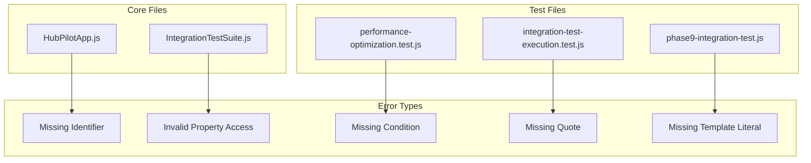

# 設計書

## 概要

HubPilot Free SEO記事作成エージェントで検出された5つのJavaScript構文エラーを体系的に修正します。各エラーは特定の構文違反によるもので、適切な修正により安定したコードベースを実現します。

## アーキテクチャ

### 修正対象ファイル構成



### エラー分析結果

| ファイル | 行番号 | エラータイプ | 詳細 |
|---------|--------|-------------|------|
| HubPilotApp.js | 1304 | Missing Identifier | `runDeveloperTests`メソッドがクラス外で定義 |
| IntegrationTestSuite.js | 436 | Invalid Property Access | `initialMemoritialMemory`の不正なプロパティ名 |
| performance-optimization.test.js | 44 | Missing Condition | `if`文の条件式が不完全 |
| integration-test-execution.test.js | 51 | Missing Quote | オブジェクトプロパティの引用符欠如 |
| phase9-integration-test.js | 42 | Missing Template Literal | `console.log`のテンプレートリテラル構文エラー |

## コンポーネントと インターフェース

### ErrorAnalyzer（エラー分析器）

```javascript
class ErrorAnalyzer {
    constructor() {
        this.errorPatterns = new Map();
        this.fixStrategies = new Map();
    }

    // エラーパターンの識別
    identifyErrorPattern(filePath, lineNumber, errorMessage) {
        // エラーパターンを分析し、修正戦略を決定
    }

    // 修正戦略の提案
    suggestFix(errorPattern, context) {
        // 適切な修正方法を提案
    }
}
```

### SyntaxFixer（構文修正器）

```javascript
class SyntaxFixer {
    constructor(errorAnalyzer) {
        this.errorAnalyzer = errorAnalyzer;
        this.backupManager = new BackupManager();
    }

    // ファイル修正の実行
    async fixFile(filePath, fixes) {
        // バックアップ作成
        // 修正の適用
        // 構文検証
    }

    // 修正の検証
    validateFix(filePath) {
        // 構文チェック
        // 基本的な実行テスト
    }
}
```

### BackupManager（バックアップ管理器）

```javascript
class BackupManager {
    // 修正前のファイルバックアップ
    createBackup(filePath) {
        // ファイルのバックアップを作成
    }

    // バックアップからの復元
    restoreFromBackup(filePath) {
        // 必要に応じてバックアップから復元
    }
}
```

## データモデル

### ErrorInfo（エラー情報）

```javascript
const ErrorInfo = {
    filePath: String,           // ファイルパス
    lineNumber: Number,         // エラー行番号
    columnNumber: Number,       // エラー列番号
    errorType: String,          // エラータイプ
    errorMessage: String,       // エラーメッセージ
    context: String,            // エラー周辺のコード
    suggestedFix: String        // 提案される修正内容
};
```

### FixResult（修正結果）

```javascript
const FixResult = {
    filePath: String,           // 修正されたファイルパス
    success: Boolean,           // 修正成功フラグ
    originalError: ErrorInfo,   // 元のエラー情報
    appliedFix: String,         // 適用された修正内容
    validationResult: Object,   // 修正後の検証結果
    timestamp: Date             // 修正実行時刻
};
```

## 正確性プロパティ

*プロパティは、システムが満たすべき特性や動作を表す形式的な記述です。これらのプロパティは、すべての有効な実行において真であるべき普遍的な規則として機能します。*

### Property 1: 構文エラー修正の完全性
*すべての*特定された構文エラーファイル（HubPilotApp.js、IntegrationTestSuite.js、performance-optimization.test.js、integration-test-execution.test.js、phase9-integration-test.js）について、修正後にJavaScript構文チェックが成功し、ファイルが正常に読み込み・実行される必要があります。
**Validates: Requirements 1.1, 1.2, 1.3, 1.4, 1.5**

### Property 2: エラーハンドリングの包括性
*すべての*修正プロセスについて、修正実行時、ファイル読み込み時、テスト実行時、予期しないエラー発生時、修正完了時に適切なログ記録、ステータス報告、エラーメッセージ提供、コード整合性検証が実行される必要があります。
**Validates: Requirements 2.1, 2.2, 2.3, 2.4, 2.5**

### Property 3: テスト実行の包括性
*すべての*修正されたファイルについて、関連するテストが実行され、クラス機能、統合テスト、パフォーマンステスト、エンドツーエンドテストが適切に検証される必要があります。
**Validates: Requirements 3.1, 3.2, 3.3, 3.4, 3.5**

### Property 4: 後方互換性の保持
*すべての*修正されたファイルについて、既存のAPI、メソッド呼び出し、テスト結果、エラー処理、システム動作が変更されずに継続して動作する必要があります。
**Validates: Requirements 4.1, 4.2, 4.3, 4.4, 4.5**

### Property 5: コード品質基準の遵守
*すべての*修正されたコードについて、JavaScript ES6+標準、適切なエラーハンドリング、適切なドキュメント、一貫した命名規約、包括的テストカバレッジに準拠する必要があります。
**Validates: Requirements 5.1, 5.2, 5.3, 5.4, 5.5**

### Property 6: 修正プロセス管理の完全性
*すべての*修正作業について、修正対象ファイルの識別・優先順位付け、修正内容の文書化・検証、修正結果のテスト・検証が実行される必要があります。
**Validates: Requirements 6.1, 6.2, 6.3**

### Property 7: 修正完了時の統合検証
*すべての*修正プロセス完了時について、システム全体の統合テストが実行され、修正サマリーが生成・レビューされる必要があります。
**Validates: Requirements 6.4, 6.5**

## エラーハンドリング

### 修正失敗時の処理

```javascript
class FixErrorHandler {
    handleFixFailure(filePath, error, backupPath) {
        // 1. エラーログの記録
        console.error(`❌ 修正失敗: ${filePath}`, error);

        // 2. バックアップからの復元
        this.backupManager.restoreFromBackup(filePath);

        // 3. 修正失敗の報告
        return {
            success: false,
            error: error.message,
            restoredFromBackup: true
        };
    }
}
```

### 検証失敗時の処理

```javascript
class ValidationErrorHandler {
    handleValidationFailure(filePath, validationErrors) {
        // 1. 検証エラーの詳細ログ
        console.warn(`⚠️ 検証失敗: ${filePath}`, validationErrors);

        // 2. 追加修正の提案
        const additionalFixes = this.suggestAdditionalFixes(validationErrors);

        // 3. 手動確認の要求
        return {
            requiresManualReview: true,
            validationErrors,
            suggestedFixes: additionalFixes
        };
    }
}
```

## テスト戦略

### 二重テストアプローチ

**単体テスト**：
- 各修正の個別検証
- エラーパターン識別の正確性テスト
- バックアップ・復元機能のテスト

**プロパティテスト**：
- 修正の完全性検証（最小100回反復）
- ファイル整合性の保持検証
- エラーハンドリングの適切性検証

### プロパティテスト設定

各プロパティテストは以下の設定で実行：
- **反復回数**: 最小100回
- **タグ形式**: **Feature: syntax-error-fixes, Property {number}: {property_text}**
- **テストライブラリ**: JavaScript用プロパティテストライブラリ（fast-check推奨）

### テスト実行順序

1. **修正前検証**: 構文エラーの存在確認
2. **修正実行**: 各ファイルの構文エラー修正
3. **修正後検証**: 構文チェックとテスト実行
4. **統合テスト**: 全体的な動作確認
5. **プロパティテスト**: 普遍的特性の検証
