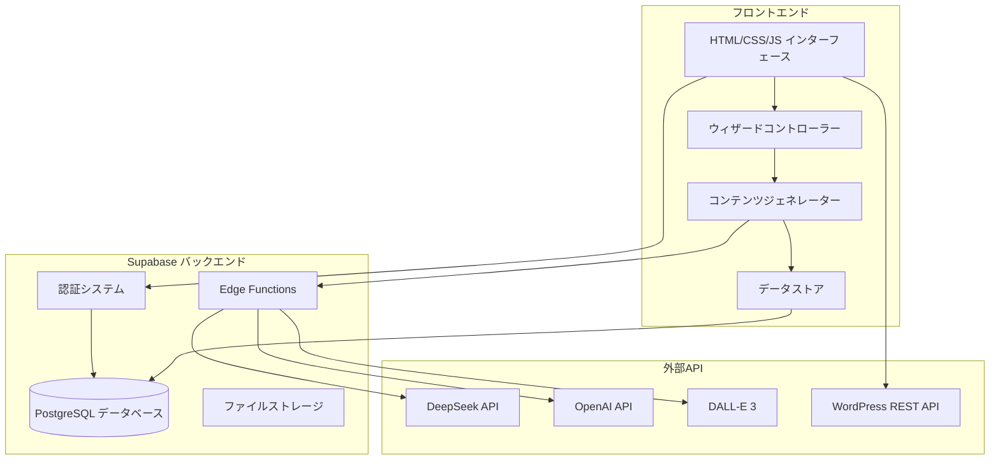
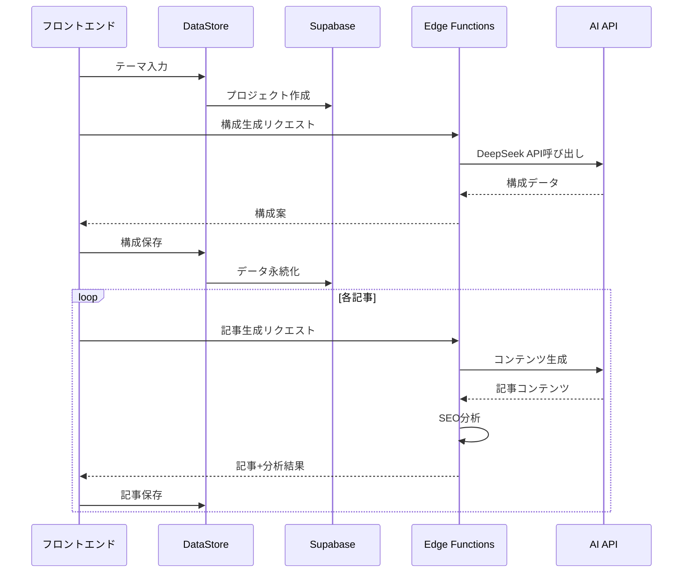
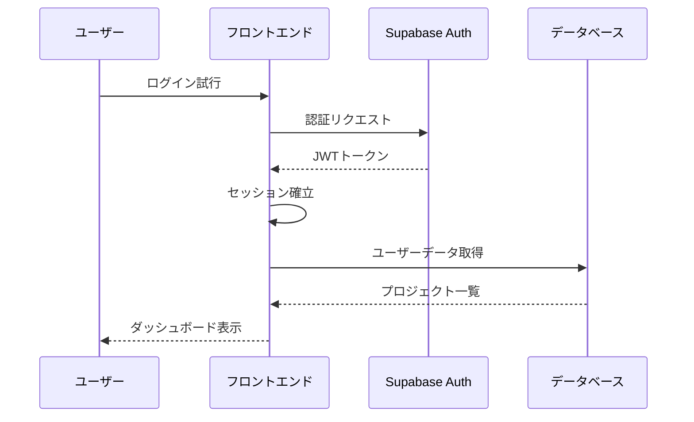

# HubPilot Free プロジェクトアーキテクチャガイド

## システム全体構成



## フロントエンド アーキテクチャ

### コアコンポーネント構成

```
src/
├── core/                    # コアビジネスロジック
│   ├── HubPilotApp.js      # メインアプリケーションクラス
│   ├── WizardController.js  # ウィザード制御
│   ├── ContentGenerator.js  # コンテンツ生成エンジン
│   ├── DataStore.js        # データ永続化管理
│   └── GenerationState.js  # 生成状態管理
├── services/               # 外部サービス連携
│   ├── SupabaseService.js  # Supabase API クライアント
│   ├── AIService.js        # AI API 統合サービス
│   └── WordPressService.js # WordPress 連携
├── ui/                     # UI コンポーネント
│   ├── WizardSteps.js      # ステップコンポーネント
│   ├── NotificationSystem.js # 通知システム
│   └── ProgressTracker.js  # 進捗表示
└── utils/                  # ユーティリティ
    ├── validators.js       # 入力検証
    ├── formatters.js       # データフォーマット
    └── helpers.js          # 汎用ヘルパー
```

### 主要クラス設計

#### HubPilotApp (メインアプリケーション)
```javascript
class HubPilotApp {
    constructor() {
        this.wizardController = new WizardController();
        this.contentGenerator = new ContentGenerator();
        this.dataStore = new DataStore();
        this.currentProject = null;
    }

    // アプリケーション初期化
    async initialize() { }

    // プロジェクト管理
    async createProject(theme) { }
    async saveProject() { }
    async loadProject(id) { }

    // デバッグ・統計機能
    debug() { }
    stats() { }
    health() { }
}
```

#### WizardController (ウィザード制御)
```javascript
class WizardController {
    constructor() {
        this.currentStep = 1;
        this.totalSteps = 6;
        this.stepData = {};
    }

    // ステップ制御
    nextStep() { }
    previousStep() { }
    goToStep(stepNumber) { }

    // データ管理
    updateStepData(step, data) { }
    validateStep(step) { }

    // UI更新
    renderStep(step) { }
    updateProgress() { }
}
```

#### ContentGenerator (コンテンツ生成)
```javascript
class ContentGenerator {
    constructor() {
        this.aiService = new AIService();
        this.generationQueue = [];
    }

    // 構成生成
    async generateStructure(theme) { }
    async generateHeadings(article) { }

    // 記事生成
    async generateArticle(config) { }
    async generateBatch(articles) { }

    // 品質チェック
    async analyzeSEO(content) { }
    async checkQuality(content) { }
}
```

## バックエンド アーキテクチャ (Supabase)

### データベーススキーマ

```sql
-- プロジェクト管理
CREATE TABLE projects (
    id UUID PRIMARY KEY DEFAULT gen_random_uuid(),
    user_id UUID REFERENCES auth.users(id),
    theme TEXT NOT NULL,
    pillar_page JSONB,
    cluster_pages JSONB[],
    status TEXT DEFAULT 'draft',
    created_at TIMESTAMP WITH TIME ZONE DEFAULT NOW(),
    updated_at TIMESTAMP WITH TIME ZONE DEFAULT NOW()
);

-- 記事管理
CREATE TABLE articles (
    id UUID PRIMARY KEY DEFAULT gen_random_uuid(),
    project_id UUID REFERENCES projects(id),
    title TEXT NOT NULL,
    content TEXT,
    headings JSONB,
    seo_score INTEGER,
    quality_score INTEGER,
    images JSONB[],
    created_at TIMESTAMP WITH TIME ZONE DEFAULT NOW()
);

-- SEO分析結果
CREATE TABLE seo_analyses (
    id UUID PRIMARY KEY DEFAULT gen_random_uuid(),
    article_id UUID REFERENCES articles(id),
    keyword_density JSONB,
    readability_score INTEGER,
    heading_structure JSONB,
    suggestions TEXT[],
    analyzed_at TIMESTAMP WITH TIME ZONE DEFAULT NOW()
);

-- 生成ログ
CREATE TABLE generation_logs (
    id UUID PRIMARY KEY DEFAULT gen_random_uuid(),
    project_id UUID REFERENCES projects(id),
    operation_type TEXT NOT NULL,
    ai_provider TEXT,
    tokens_used INTEGER,
    cost_estimate DECIMAL(10,4),
    success BOOLEAN,
    error_message TEXT,
    created_at TIMESTAMP WITH TIME ZONE DEFAULT NOW()
);

-- 画像管理
CREATE TABLE images (
    id UUID PRIMARY KEY DEFAULT gen_random_uuid(),
    article_id UUID REFERENCES articles(id),
    image_type TEXT NOT NULL, -- 'hero', 'content'
    prompt TEXT,
    url TEXT,
    storage_path TEXT,
    generated_at TIMESTAMP WITH TIME ZONE DEFAULT NOW()
);
```

### Edge Functions 構成

#### generate-article
```typescript
// 記事生成メイン関数
export async function generateArticle(request: Request) {
    const { theme, keywords, structure } = await request.json();

    try {
        // DeepSeek API優先で生成
        const content = await callDeepSeekAPI({
            prompt: buildArticlePrompt(theme, keywords, structure),
            maxTokens: 4000
        });

        return new Response(JSON.stringify({
            success: true,
            content,
            provider: 'deepseek'
        }));
    } catch (error) {
        // OpenAI フォールバック
        return await fallbackToOpenAI(theme, keywords, structure);
    }
}
```

#### analyze-seo
```typescript
// SEO分析関数
export async function analyzeSEO(request: Request) {
    const { content, targetKeywords } = await request.json();

    const analysis = {
        keywordDensity: calculateKeywordDensity(content, targetKeywords),
        readabilityScore: calculateReadability(content),
        headingStructure: analyzeHeadings(content),
        suggestions: generateSuggestions(content, targetKeywords)
    };

    return new Response(JSON.stringify(analysis));
}
```

#### generate-images
```typescript
// 画像生成関数
export async function generateImages(request: Request) {
    const { articleTitle, content, imageType } = await request.json();

    const prompt = generateImagePrompt(articleTitle, content, imageType);

    try {
        const imageUrl = await callDALLE3(prompt);

        // Supabase Storageに保存
        const storagePath = await uploadToStorage(imageUrl, articleTitle);

        return new Response(JSON.stringify({
            success: true,
            imageUrl,
            storagePath,
            prompt
        }));
    } catch (error) {
        return new Response(JSON.stringify({
            success: false,
            error: error.message
        }), { status: 500 });
    }
}
```

## データフロー設計

### 記事生成フロー


### 認証フロー


## セキュリティアーキテクチャ

### Row Level Security (RLS)
```sql
-- プロジェクトは所有者のみアクセス可能
CREATE POLICY "Users can only access their own projects" ON projects
    FOR ALL USING (auth.uid() = user_id);

-- 記事は関連プロジェクトの所有者のみアクセス可能
CREATE POLICY "Users can only access articles from their projects" ON articles
    FOR ALL USING (
        EXISTS (
            SELECT 1 FROM projects
            WHERE projects.id = articles.project_id
            AND projects.user_id = auth.uid()
        )
    );
```

### API キー管理
```typescript
// Edge Functions内でのセキュアなAPI呼び出し
const DEEPSEEK_API_KEY = Deno.env.get('DEEPSEEK_API_KEY');
const OPENAI_API_KEY = Deno.env.get('OPENAI_API_KEY');

// フロントエンドには公開しない
if (!DEEPSEEK_API_KEY) {
    throw new Error('DeepSeek API key not configured');
}
```

## パフォーマンス最適化

### フロントエンド最適化
- **遅延読み込み**: 大きなコンポーネントの動的インポート
- **キャッシュ戦略**: LocalStorageでAPI結果をキャッシュ
- **バッチ処理**: 複数記事の並列生成
- **プログレッシブ表示**: 生成中の段階的UI更新

### バックエンド最適化
- **接続プール**: Supabaseの自動接続管理
- **インデックス最適化**: 頻繁なクエリにインデックス
- **Edge Functions**: グローバル分散実行
- **CDN**: 静的アセットの配信最適化

## 監視・ログ設計

### フロントエンド監視
```javascript
// パフォーマンス監視
class PerformanceMonitor {
    static trackOperation(name, operation) {
        const start = performance.now();
        const result = operation();
        const duration = performance.now() - start;

        console.log(`[Performance] ${name}: ${duration.toFixed(2)}ms`);
        return result;
    }
}

// エラー追跡
window.addEventListener('error', (event) => {
    console.error('[Global Error]', {
        message: event.message,
        filename: event.filename,
        lineno: event.lineno,
        colno: event.colno,
        stack: event.error?.stack
    });
});
```

### バックエンド監視
```typescript
// Edge Functions ログ
export async function logOperation(
    operation: string,
    success: boolean,
    metadata: any
) {
    await supabase.from('generation_logs').insert({
        operation_type: operation,
        success,
        metadata,
        created_at: new Date().toISOString()
    });
}
```

## 拡張性設計

### プラグインアーキテクチャ
```javascript
// 新しいAIプロバイダーの追加
class AIProviderRegistry {
    static providers = new Map();

    static register(name, provider) {
        this.providers.set(name, provider);
    }

    static get(name) {
        return this.providers.get(name);
    }
}

// 使用例
AIProviderRegistry.register('claude', new ClaudeProvider());
AIProviderRegistry.register('gemini', new GeminiProvider());
```

### 設定駆動開発
```javascript
// 機能フラグによる段階的リリース
const FEATURE_FLAGS = {
    imageGeneration: true,
    wordpressIntegration: true,
    hubspotIntegration: false, // 将来実装
    advancedSEO: false
};

function isFeatureEnabled(feature) {
    return FEATURE_FLAGS[feature] || false;
}
```

このアーキテクチャガイドに従うことで、スケーラブルで保守性の高いSEO記事作成エージェントを構築・拡張できます。
